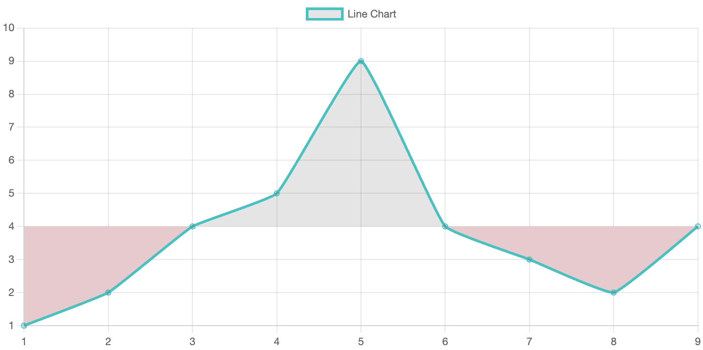

---
runme:
  id: 01HK5TJGQ2R1C7K64RD6BG4SVH
  version: v2.0
---

# Notes

## solution description step-by-step

1.

## problems

- problem with the tutorial on Chart JS documentation about the import. see more in this issue opened recently: https://github.com/chartjs/Chart.js/issues/10915. my error: not build with `yarn dev`

---

## questions

- how do i select the threshold? with an input or with a click on the chart?
- when select the threshold, it can be float, or just integer?